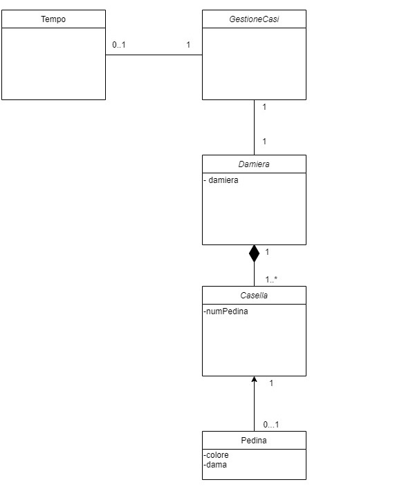
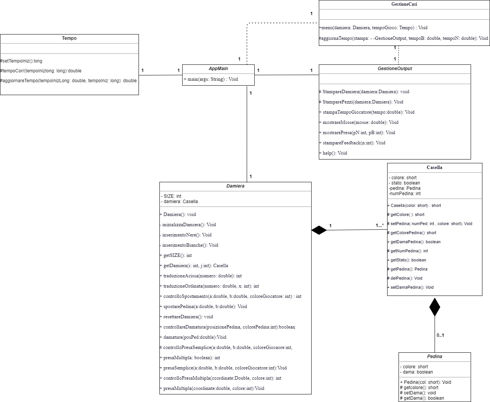
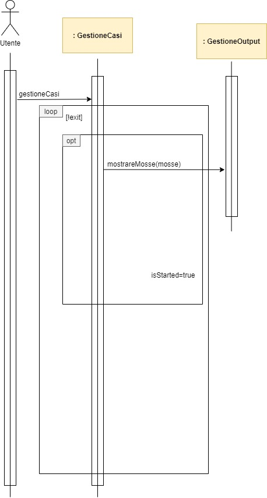
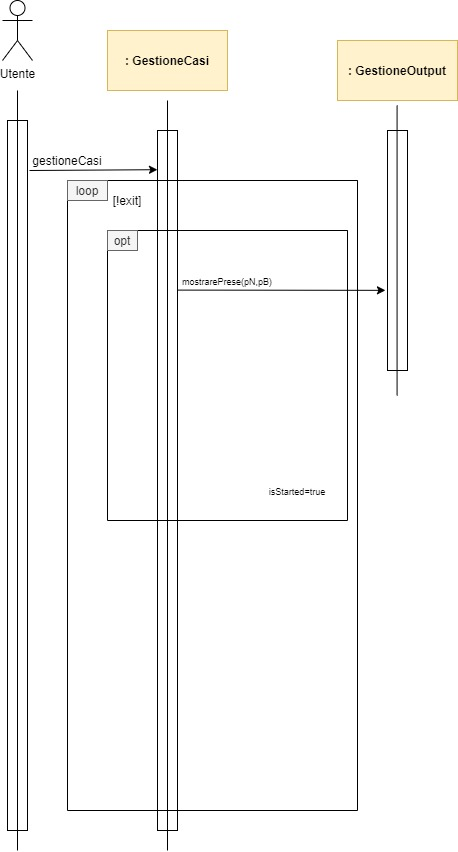
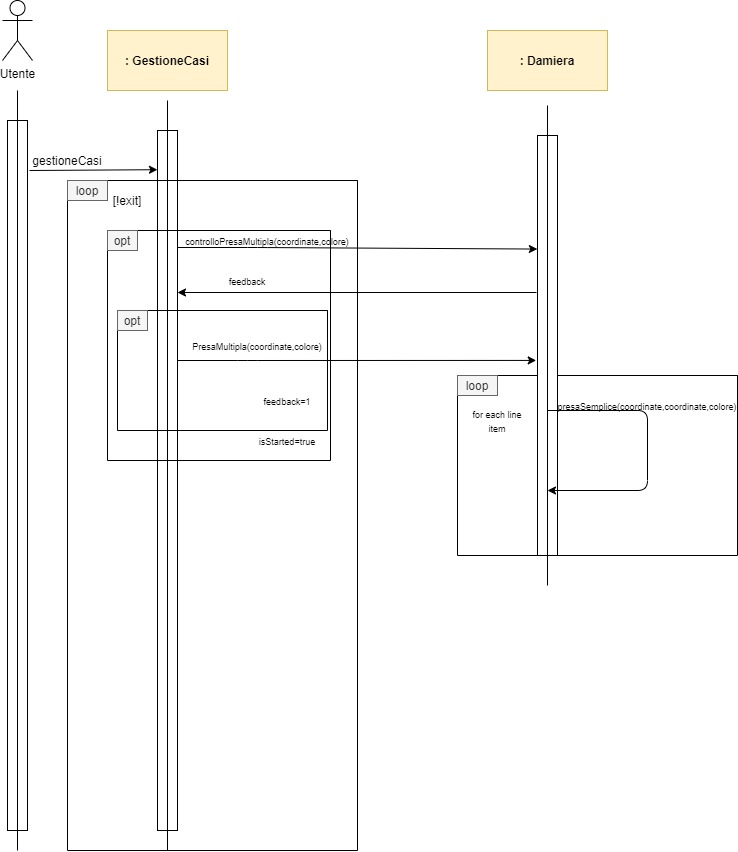
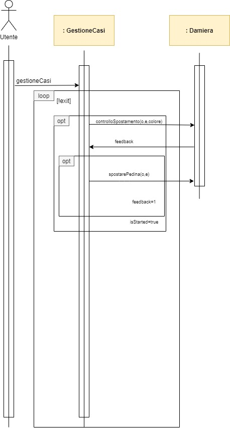
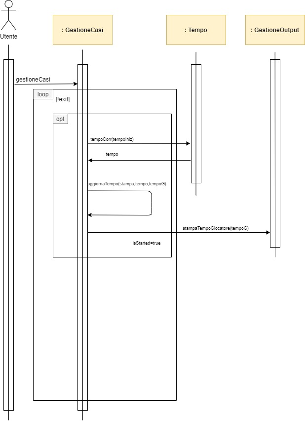
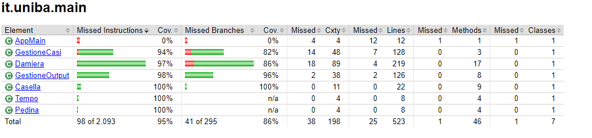

# Dama Italiana
## Indice
1. [Introduzione](#1.-Introduzione)
2. [Modello di dominio](#2-Modello-di-dominio)
3. [Requisiti specifici](#3-Requisiti-specifici)
4. [System Design](#4-System-Design)
5. [OO Design](#5-OO-Design)
6. [Riepilogo del test](#6-Riepilogo-dei-test)
7. [Manuale utente](#7-Manuale-utente)
8. [Processo di sviluppo e organizzazione del lavoro](#8-Processo-di-sviluppo-e-organizzazione-del-lavoro)
9. [Analisi retrospettiva](#9-Analisi-retrospettiva)
### **1. Introduzione** 
    L'applicazione su CLI "Dama Italiana" è stata sviluppata come parte 
    del progetto di Ingegneria del Software dell'anno accademico 2020/2021.
    Lo sviluppo del progetto è stato fatto simulando la metodologia Scrum.
### **2. Modello di dominio**

### **3. Requisiti Specifici**
####  **a. Requisiti Funzionali**

1.  **mostrare elenco comandi**
    in modo tale da visualizzare l'elenco dei comandi disponibili.

    
    **Criteri di accettazione**:
    
    > eseguendo il comando **help**:
    - il risultato è una lista di comandi disponibili.

2. **iniziare una nuova partita** così facendo partirà una nuova partita.

   **Criteri di accettazione**:
   
    > al comando **gioca**:
    - l'applicazione si predispone a ricevere la prima mossa di gioco da parte delle pedine bianche,
    - l'applicazione potrà ricevere altri comandi.

3. **chiudere il gioco** così facendo l'applicazione verrà chiusa.

   **Criteri di accettazione**:
   
    > al comando **esci**:
    - l'applicazione chiede conferma,
    - se la risposta è positiva, l'applicazione verrà chiusa,
    -  se la risposta è negativa, l'applicazione non verrà chiusa.

4. **mostrare la damiera numerata** così facendo verrà stampata a video la damiera con le coordinate per lo spostamento delle pedine.

    **Criteri di accettazione**:
    > al comando **numeri**:
    - l'applicazione mostra la damiera numerata.

5. **mostrare la damiera**
così da poter stampare a video la damiera con le pedine in caratteri Unicode.

   **Criteri di accettazione**:
   
    > al comando **damiera**:
    - l'applicazione mostra la posizione delle varie pedine sulla damiera.
6. **mostrare il tempo trascorso** così da far stampare a video il tempo trascorso dei due giocatori.

    **Criteri di accettazione**:
   
    > al comando **tempo**:
    - l'applicazione mostra il tempo trascorso dei due giocatori dall'inizio della partita(Viene preso in considerazione il tempo in cui il giocatore può fare una mossa)
7. **mostrare le mosse giocate**
così facendo verranno mostrate tutte le mosse effettuate dall'inizio della partita.

   **Criteri di accettazione**:
   
    > al comando **mosse**:
    - l'applicazione mostra tutte le mosse effettuate dell'inizio della partita.
    - Esempio:
    > 1. 21-17
    > 2. 11-14
    > 3. 14x7

7. **mostrare le prese effettuate**
verranno mostrate le pedine mangiate da entrambi i giocatori.
    
     **Criteri di accettazione**:
   
    > al comando **prese**:
    - l'applicazione mostra tutte le prese fatte dell'inizio della partita dei due giocatori.

8. **abbandonare la partita** così facendo potremmo interrompere la partita.

     **Criteri di accettazione**:
   
    > al comando **abbandona**:
    - l'applicazione chiede conferma,
    - se la conferma è positiva, l'applicazione enuncerà l'abbandono di quest'ultimo e la vincita del suo avversario,
    - se la risposta è negativa, la partita continuerà regolarmente.

#### **b. Requisiti non funzionali**

- Per avviare l'applicazione deve poter essere eseguita sui seguenti terminali: 
  -  Windows
  - Linux Terminal
  - Mac OS Terminal

  - Inoltre l'applicazione deve supportare i caratteri Unicode per visualizzare le pedine della damiera (se su terminale windows si dovessero visualizzare "?" invece di pedine  si consiglia di utilizzare il comando "chcp 65001" prima dell'avvio dell'applicazione).

### **4. System Design**
    Non è stato utilizzato nessun tipo di stile architetturale.
    Tutto il programma è stato sviluppato in unico package.

### **5. OO Design**
Nonostante la scelta iniziale fosse di implementare anche una classe **Giocatore**, col tempo ci siamo resi conto che l'implentazione di quest'ultima era superflua in quanto le informazioni che dovevamo trascinarci dietro dalla classe Giocatore erano trascurabili e difficili da gestire con il modello ECB.

Durante i test di qualità abbiamo riscontrato un problema con il metodo **Menù** nella classe GestioneCasi: di fatto aveva troppe righe di codice per gli standard di checkstyle e quindi si è subito provveduto a dividere parte del codice in metodi secondari.
Ciò è stato parzialmente possibile in quanto la struttura di **Menù** non permetteva un'adeguata suddivisione in metodi più corti e quindi non è stato possibile risolvere definitivamente l'errore segnalato da checkstyle.

### **6. Riepilogo dei Test**

Se si volesse vedere l'intero riepilogo dei test basterebbe utilizzare questo
[link](https://coveralls.io/github/softeng2021-inf-uniba/progetto2021bis-gamma).

### **7. Manuale utente**
Il software è reso disponibile tramite la piattaforma Docker che automatizza i processi di deployment e include inoltre funzionalità di containerizzazione.
Una volta avviata sarà possibile selezionare i seguenti comandi:
- **help**: mostra l'elenco dei comandi.
- **gioca** : permette di iniziare una partita.
- **esci** : permette di uscire dall'applicazione.
- **numeri** : mostra la damiera numerata.

A partita avviata tramite il comando gioca potremmo utilizzare i restanti comandi:
- **damiera**: mostra la damiera con le pedine.
- **tempo** : permettere di visualizzare il tempo trascorso dei due giocatori.
- **mosse** : permette di visulizzare tutte le mosse fatte dai due giocatori.
- **prese** : mostra le pedine prese dai due giocatori.
- **abbandona** : permette ad un giocatore di abbandonare la partita con annessa sconfitta di quest'ultimo.

### **8. Processo di sviluppo e organizzazione del lavoro**
Per lo sviluppo dell'applicazione "Dama Italiana" è stato utilizzato il metodo di sviluppo "agile".
Nella fattispecie è stata utilizzata la metodologia **Scrum**.
Il team gamma è composto da sette persone, e il progetto è stato suddivisio in quattro "Sprint", a monte di ogni sprint  é avvenuto un vero e proprio sprint planning, durante una chiamata con tutti i membri del gruppo, in cui é stata compilata la Kanban board, di Github, per gestire al meglio il lavoro da effettuare durante l'avanzamento di ogni sprint.
- Lo sprint 0 si è posto come obbiettivo di dimostrare familiarità con GitHub e il processo agile. 
Il lavoro è stato completamente sincrono, nonostante ognuno avesse la propria issue e ci abbia lavorato individualmente; ci siamo cimentati nell'utilizzo di GitHub, con le sue varie funzioni come la creazione delle issue e l'inserimento nella project board, e ci siamo inoltre interfacciati con git bash imparando a gestire le azioni da fare tramite linea di comando. 
L'errore in questo sprint è stato lo stile misto nelle pull request e la scarsa descrizione di modalità immessa nel milestone. 
- Con lo sprint 1, invece, l'obbiettivo è stato l'implementazione di comandi e spostamenti semplici, infatti, abbiamo iniziato ad utilizzare il linguaggio Java. Il gruppo è stato unito nonostante le difficoltà iniziali di chi non avesse mai utilizzato precedentemente tale linguaggio, grazie all'aiuto dei componenti che avevano già conoscenze pregresse. Questa parte dello sviluppo è stata la più problematica, in quanto, abbiamo implementato il comando tempo in maniera errata. Ciò ha impedito di poter eseguire tutti i comandi collegati a "gioca", pensando però che per vedere il tempo di gioco del giocatore nero, si dovesse eseguire un mossa.
Essendo però questo sprint privo di tale implementazione, abbiamo deciso di implementare una mossa fittizia con il comando "mossa", considerando erroneamente che, non essendo nella parte finale della progettazione, questa scelta si sarebbe potuta comprendere dalla visione del codice e dei suoi commenti.
- Nello sprint 2, l'obbiettivo era il mediogioco, abbiamo dovuto implementare comandi più complessi e inserire i caratteri unicode. In questo sprint il lavoro è stato molto più individuale ma non sono mancati momenti per aggiornare il gruppo delle decisioni prese e rivedere insieme il lavoro individuale di ognuno. Il problema che si è posto in questo sprint è legato alla mancanza di commento sulle responsabilità delle classi (ECB) e la tabella per le prese poco comprensibile.
- Nell'ultimo sprint invece l'obbiettivo è stato risolvere tutti i problemi legati allo sprint 2, eseguire test sulla qualità e sul funzionamento del programma e, successivamente, documentare tutto il lavoro svolto in questo e nei precedenti sprint.

La comunicaziona tra i membri del team si é svolta tramite WhatsApp e Discord per la comunzione Voip, inoltre, in caso di problematiche, é stata utilizzata la condivisione del Desktop remoto (Team Viewer).

### **9. Analisi retrospettiva**
Ciò che ha spiccato maggiormente tra gli aspetti più soddisfacenti di questo progetto sono stati l'uso di GitHub, strumento che ci ha permesso di lavorare in maniera agile e l'approccio **Scrum** che ci ha dato l'oppurtunità di metterci a confronto con il mondo del lavoro.
E' stato interessante imparare a implementare e gestire il Github Flow sul controllo di versioni il quale sicuramente ci ha avvantaggiati per il futuro lavorativo e ci ha dato la possibilità di concentrarci su elementi importanti quali reversibilità e manutenibilità che caratterizzano la qualità del progetto. 
Nonostante le difficoltà riscontrate dettate dal fatto che inizialmente alcuni componenti non conoscevano il linguaggio con cui abbiamo lavorato e che il team era composto per la maggior parte da gente che non si non conosceva in precedenza, siamo riusciti a trovare una soluzione per la risoluzione dei vari problemi; inoltre, avendo carta bianca per la progettazione, abbiamo potuto mettere mani noi in prima persona con il linguaggio che dovevamo apprendere.
Dopo ogni **Sprint** ci siamo "riuniti" a distanza in un meeting di retrospettiva per discutere su quali fattori dovevamo migliorare, cosa evitare e come organizzarci con il lavoro da portare avanti. 
Fortunatamente non abbiamo riscontrato particolari aspetti frustranti se non per la parte iniziale dello Sprint 0 dove abbiamo dovuto apprendere le modalità di come avremmo dovuto sviluppare e gli eventuali problemi tecnici.
Nel complesso è stata una sfida molto stimolante per aggiudicarci il miglior punteggio alla fine di ciascuno Sprint e anche se abbiamo ottenuto un punteggio basso alla fine dello Sprint 1, abbiamo messo ancora più impegno per gli sprint successivi per poter recuperare il punteggio preso.